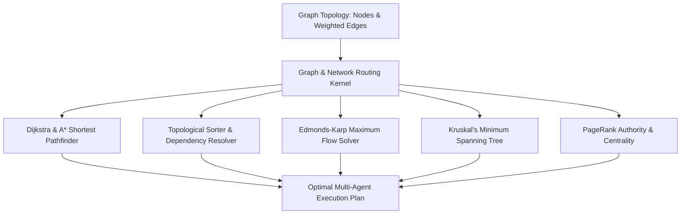

# genpark-topological-sorter-tarjan-scc-skill

<div align="center">

[](https://www.python.org/)
[](LICENSE)
[](https://genpark.ai/mcp)
[](https://genpark.ai)
[-brightgreen.svg?style=for-the-badge)](requirements.txt)

<p align="center">
  <b>Production-Grade Graph Theory & Network Flow Agent Skill</b> • <b>100% Standard Library Python</b> • <b>Native Model Context Protocol (MCP)</b>
</p>

</div>

---

## ⚡ Overview & Architectural Significance

`genpark-topological-sorter-tarjan-scc-skill` delivers zero-dependency graph pathfinding, topological dependency resolution, network maximum flow, and centrality ranking engineered strictly using Python 3.9+ standard library.

### 🌟 Key Architectural Capabilities
- **Zero External Dependencies**: Operates exclusively via pure Python (`heapq`, `collections`, `math`, `json`). Zero NetworkX or SciPy build overhead.
- **Enterprise Graph Invariants**: Implements formal Dijkstra/A* priority queue path traversal, Kahn's DAG topological sorting, Edmonds-Karp BFS residual flow augmentation, Kruskal's disjoint-set minimum spanning tree, and PageRank random surfer power iteration.
- **Native Anthropic MCP Protocol**: Compliant with standard JSON-RPC 2.0 stdio MCP specifications for Claude Desktop, Cursor, and Windsurf.

---

## 🏗️ Architectural Topology & State Machine



---

## 🚀 Quickstart & Standalone Execution

### Local Python Client Usage

```python
from client import GraphDAGAnalyzer

# Initialize engine
engine = GraphDAGAnalyzer()

# Execute self-testing benchmark suite
result = engine.benchmark_topological_analysis()
print("Execution Result:", result)
```

---

## 🔌 One-Click MCP Integration (Claude Desktop / Cursor)

Add to your `claude_desktop_config.json` or `cursor.json`:

```json
{
  "mcpServers": {
    "genpark-topological-sorter-tarjan-scc-skill": {
      "command": "python",
      "args": ["-u", "/path/to/genpark-topological-sorter-tarjan-scc-skill/mcp_server.py"]
    }
  }
}
```

---

## 📦 Smithery.ai & PyPI Deployment

This skill contains pre-configured `smithery.yaml` and `pyproject.toml` manifests. Install directly via pip:

```bash
pip install git+https://github.com/alphaparkinc/genpark-topological-sorter-tarjan-scc-skill.git
```

---

<div align="center">
  <sub>Maintained with ❤️ by <b><a href="https://genpark.ai">GenPark AI Engineering</a></b> • Powering Graph Intelligence in Autonomous Agents 🌍</sub>
</div>
